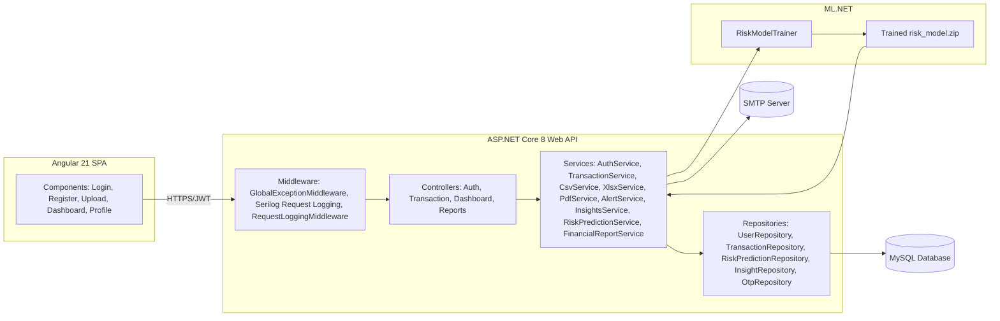

# AI Financial Health Analyzer

An end-to-end personal finance application that ingests bank/wallet statements (CSV, XLSX, XLS, or PDF), automatically categorizes transactions, and uses a hybrid rules + ML.NET model to produce an explainable financial **risk score**, **insights**, an interactive **dashboard**, **email alerts**, and a downloadable **PDF report**.

The backend is an ASP.NET Core 8 Web API with EF Core (MySQL via Pomelo). The frontend is an Angular 21 single-page application. Risk classification is powered by a custom-trained ML.NET multiclass model layered on top of a transparent, explainable rule-based scorecard.

---

## Table of Contents

1. [Project Overview](#project-overview)
2. [Key Features](#key-features)
3. [Technology Stack](#technology-stack)
4. [Project Architecture](#project-architecture)
5. [Repository Structure](#repository-structure)
6. [Backend Setup](#backend-setup)
7. [Frontend Setup](#frontend-setup)
8. [Database Setup](#database-setup)
9. [Environment Configuration](#environment-configuration)
10. [Running the Backend](#running-the-backend)
11. [Running the Frontend](#running-the-frontend)
12. [Running Unit Tests](#running-unit-tests)
13. [Running Integration Tests](#running-integration-tests)
14. [ML Model Overview](#ml-model-overview)
15. [Authentication Flow](#authentication-flow)
16. [Email Alert Feature](#email-alert-feature)
17. [PDF / CSV / Excel Upload Support](#pdf--csv--excel-upload-support)
18. [Dashboard Features](#dashboard-features)
19. [Risk Prediction Workflow](#risk-prediction-workflow)
20. [Logging](#logging)
21. [Screenshots](#screenshots)
22. [Future Improvements](#future-improvements)
23. [Contributors](#contributors)
24. [License](#license)

---

## Project Overview

AI Financial Health Analyzer lets a user register, log in, and upload a bank or wallet statement. The backend parses the file, classifies each transaction as a credit or debit, predicts a spending category, stores it in MySQL, and computes:

- A **spending summary** (totals, averages, category and monthly breakdowns)
- A **financial risk level** (`Low` / `Medium` / `High`) using an explainable scorecard reconciled against an ML.NET model prediction
- A list of **AI-generated insights** describing *why* the risk level is what it is
- An **email alert** summarizing the risk assessment
- A downloadable **PDF financial health report**

All of this is surfaced on an Angular dashboard with interactive Chart.js visualizations.

## Key Features

- **Email/password registration and login** with BCrypt password hashing
- **Google Sign-In** (OAuth ID token verification)
- **Mobile OTP login** (development OTP sender logs the OTP to the console)
- **JWT bearer authentication** for all protected API routes
- **User profile management** (view/update profile, change password)
- **Multi-format statement upload**: CSV, XLSX, XLS, and PDF (Paytm statement format)
- **Automatic transaction categorization** via keyword-based prediction
- **Automatic credit/debit direction detection** (explicit type column → signed amounts → safe debit default)
- **Duplicate transaction detection** on upload (date + description + amount composite key)
- **Spending summary analytics**: totals, category breakdown, monthly breakdown with month-over-month change
- **Explainable rule-based risk scorecard** combined with an ML.NET-trained multiclass classification model
- **AI-generated insights** tied to the same features used for risk scoring
- **Email alerts** sent automatically after every successful upload and on-demand risk check
- **Downloadable PDF financial health report** (QuestPDF)
- **Background model training** at application startup, with hot-swap of the live prediction model
- **Structured logging** via Serilog (console + rolling file sink)
- **Global exception handling middleware** returning a consistent JSON error envelope
- **Interactive Angular dashboard** with doughnut, bar, line, and gauge charts (Chart.js)
- **Clear-all-data** option to let a user wipe their transactions and re-upload

## Technology Stack

### Backend

| Concern | Technology |
|---|---|
| Framework | ASP.NET Core 8 (Web API) |
| ORM | Entity Framework Core 8 |
| Database provider | Pomelo.EntityFrameworkCore.MySql (MySQL) |
| Authentication | JWT Bearer (`Microsoft.AspNetCore.Authentication.JwtBearer`), Google Sign-In (`Google.Apis.Auth`) |
| Password hashing | BCrypt.Net-Next |
| Machine learning | Microsoft.ML (ML.NET) — `SdcaMaximumEntropy` multiclass classifier |
| CSV parsing | Custom hand-rolled parser (no third-party CSV library) |
| Excel parsing | EPPlus |
| PDF parsing (statement ingestion) | PdfPig |
| PDF generation (reports) | QuestPDF |
| Email | MailKit / MimeKit (SMTP) |
| Logging | Serilog (Console + File sinks, environment & thread enrichers) |
| API documentation | Swashbuckle (Swagger / OpenAPI), Development environment only |
| Testing | NUnit, Moq, FluentAssertions, `Microsoft.AspNetCore.Mvc.Testing` (in-memory integration tests) |

### Frontend

| Concern | Technology |
|---|---|
| Framework | Angular 21 (standalone components) |
| Charts | Chart.js 4 |
| HTTP | Angular `HttpClient` with a functional auth interceptor |
| Routing/guards | Angular Router with a functional `CanActivateFn` auth guard |
| Forms | Angular Forms (`FormsModule`, template-driven forms) |
| Unit testing | Vitest (Angular CLI's default unit test runner) |
| Styling | Plain CSS per component |

## Project Architecture

The system follows a layered architecture on the backend (Controllers → Services → Repositories → EF Core/MySQL) and a standalone-component Angular SPA on the frontend that talks to the API exclusively over HTTPS/HTTP with JWT bearer tokens.



See [`docs/Architecture-Overview.md`](docs/Architecture-Overview.md) for the full breakdown of each layer.

## Repository Structure

```
AI-Financial-Health-Analyzer/
├── AI.FinancialHealthAnalyzer.sln
├── README.md
├── test.csv                          # Sample CSV statement
├── test.xlsx                         # Sample XLSX statement
├── docs/                             # Project documentation (this folder)
│
├── Backend/
│   ├── Program.cs                    # App startup, DI registration, middleware pipeline
│   ├── appsettings.json
│   ├── Backend.csproj
│   ├── Controllers/
│   │   ├── AuthController.cs
│   │   ├── TransactionController.cs
│   │   ├── DashboardController.cs
│   │   └── ReportsController.cs
│   ├── Middleware/
│   │   ├── GlobalExceptionMiddleware.cs
│   │   └── RequestLoggingMiddleware.cs
│   ├── Models/
│   │   ├── User.cs, Transaction.cs, Category.cs, Insight.cs
│   │   ├── RiskPrediction.cs, AuthProvider.cs, OtpRequest.cs
│   │   ├── ApiResponse.cs
│   │   ├── ML/RiskModelData.cs       # RiskInput, RiskOutput, UserRiskFeatures
│   │   └── DTOs/
│   │       ├── AuthDtos.cs
│   │       ├── DashboardDtos.cs
│   │       ├── SpendingDtos.cs
│   │       └── FileProcessingDtos.cs
│   ├── Services/
│   │   ├── AuthService.cs
│   │   ├── TransactionService.cs
│   │   ├── CsvService.cs / XlsxService.cs / PdfService.cs
│   │   ├── CategoryPredictionService.cs
│   │   ├── TransactionFilters.cs
│   │   ├── FinancialFeatureExtractor.cs
│   │   ├── RiskLabelGenerator.cs
│   │   ├── RiskPredictionService.cs
│   │   ├── RiskModelTrainer.cs
│   │   ├── ModelTrainingHostedService.cs
│   │   ├── InsightsService.cs
│   │   ├── FinancialReportService.cs
│   │   ├── AlertService.cs
│   │   ├── SmtpEmailSender.cs / SmtpSettings.cs / IEmailSender.cs
│   │   └── DevelopmentOtpSender.cs / IOtpSender.cs
│   ├── Repositories/
│   │   ├── UserRepository.cs, TransactionRepository.cs
│   │   ├── RiskPredictionRepository.cs, InsightRepository.cs, OtpRepository.cs
│   │   └── Interfaces/               # I*Repository / I*Service contracts
│   ├── Data/
│   │   └── AppDbContext.cs
│   ├── Migrations/                   # EF Core migrations (MySQL)
│   └── Backend.Tests/
│       ├── tests/Controllers/        # AuthControllerTests, ReportsControllerTests
│       ├── tests/Services/           # AuthServiceTests, RiskLabelGeneratorTests,
│       │                             # FinancialFeatureExtractorTests, TransactionFiltersTests,
│       │                             # PdfServiceTests
│       └── tests/Integration/        # AuthIntegrationTests, TransactionIntegrationTests,
│                                      # DashboardIntegrationTests, ReportsIntegrationTests,
│                                      # CustomWebApplicationFactory, TestAuthHandler
│
└── ui/                                # Angular 21 frontend
    ├── angular.json, package.json
    └── src/
        ├── main.ts
        ├── environments/environment.ts
        └── app/
            ├── app.component.ts / app.routes.ts / app.config.ts
            ├── guards/auth-guard.ts
            ├── interceptors/auth.interceptor.ts
            ├── services/
            │   ├── auth.service.ts
            │   ├── transaction.service.ts
            │   ├── dashboard.service.ts
            │   └── chart.service.ts
            └── components/
                ├── login/
                ├── register/
                ├── upload/
                ├── dashboard/
                └── profile/
```

## Backend Setup

### Prerequisites

- [.NET 8 SDK](https://dotnet.microsoft.com/download/dotnet/8.0)
- A running **MySQL** server (local or remote)
- (Optional) An SMTP account for sending real risk-alert emails
- (Optional) A Google OAuth Client ID, if you want Google Sign-In to work

### Install dependencies

```bash
cd Backend
dotnet restore
```

### Apply database migrations

```bash
dotnet ef database update
```

> If `dotnet-ef` is not installed: `dotnet tool install --global dotnet-ef`

## Frontend Setup

### Prerequisites

- [Node.js](https://nodejs.org/) (compatible with Angular CLI 21)
- npm 10+

### Install dependencies

```bash
cd ui
npm install
```

## Database Setup

The backend uses **MySQL** through EF Core via the Pomelo provider. The connection string is read from `ConnectionStrings:DefaultConnection` in `appsettings.json` (or environment-specific overrides / user secrets).

Example connection string:

```
Server=localhost;Port=3306;Database=FinancialHealthAnalyzer;User=root;Password=yourpassword;
```

The schema is created and evolved exclusively through EF Core migrations located in `Backend/Migrations/`:

| Migration | Purpose |
|---|---|
| `InitialMySql` | Initial `Users`, `Categories`, `Transactions` tables |
| `AddPasswordHash` | Adds password hash and related auth columns to `Users` |
| `FixAmountPrecision` | Corrects `decimal` precision on `Transaction.Amount` |
| `AddRiskAndInsights` | Adds `RiskPredictions` and `Insights` tables |
| `FixDecimalPrecisionAndUniqueEmail` | Decimal precision fixes; unique index on `Users.Email` |
| `FixRiskPredictionPrecision` | Decimal precision fixes on `RiskPrediction` columns |
| `ImproveRiskPredictionFeatures` | Adds extended feature-snapshot columns to `RiskPrediction` |
| `AddGoogleAndMobileOtpAuth` | Adds `AuthProviders` and `OtpRequests` tables for Google/OTP login |
| `AddIsCreditToTransaction` | Adds the `IsCredit` boolean column to `Transaction` |

When `ASPNETCORE_ENVIRONMENT=Testing`, the application switches to EF Core's **InMemory** provider instead of MySQL (see `Program.cs`), so no real database is required to run the automated test suite.

## Environment Configuration

### Backend — `Backend/appsettings.json`

Key sections you need to fill in:

```json
{
  "ConnectionStrings": {
    "DefaultConnection": ""
  },
  "Jwt": {
    "Key": "",
    "Issuer": "AIFinancialAnalyzer",
    "Audience": "AIFinancialAnalyzerUsers",
    "ExpiryDays": 7
  },
  "Cors": {
    "AllowedOrigins": [ "http://localhost:4200" ]
  },
  "Authentication": {
    "Google": {
      "ClientId": ""
    }
  },
  "Otp": {
    "ExpiryMinutes": 5,
    "MaxAttempts": 5
  },
  "Smtp": {
    "Host": "smtp.gmail.com",
    "Port": 587,
    "EnableSsl": true,
    "FromEmail": "your-email@gmail.com",
    "FromName": "AI Financial Health Analyzer",
    "Username": "",
    "Password": ""
  }
}
```

Notes:

- `Jwt:Key` **must** be at least 32 characters (HS256 requirement) or the app throws on startup.
- `ConnectionStrings:DefaultConnection` is required outside the `Testing` environment, or the app throws on startup.
- Sensitive values (DB password, JWT key, SMTP credentials, Google Client ID) should be supplied via `appsettings.Development.json`, environment variables, or [.NET user secrets](https://learn.microsoft.com/aspnet/core/security/app-secrets) — `appsettings.*.json` files (other than the base `appsettings.json`) are already excluded by `.gitignore`.

### Frontend — `ui/src/environments/environment.ts`

```ts
export const environment = {
  production: false,
  apiUrl: 'http://localhost:5257/api',
  googleClientId: '<your-google-oauth-client-id>'
};
```

`apiUrl` must point at the running backend, and `googleClientId` must match the OAuth Client ID configured in `Authentication:Google:ClientId` on the backend for Google Sign-In to work end-to-end.

## Running the Backend

```bash
cd Backend
dotnet run
```

By default (see `Properties/launchSettings.json`):

- HTTP: `http://localhost:5257`
- HTTPS: `https://localhost:7235`

In the `Development` environment, Swagger UI is available at `/swagger`.

On startup, `ModelTrainingHostedService` loads any previously saved ML risk model (`Models/risk_model.zip`) if present, then retrains in the background using current transaction data and hot-swaps the live model once training completes.

## Running the Frontend

```bash
cd ui
ng serve
```

Then open `http://localhost:4200`.

## Running Unit Tests

The test project `Backend/Backend.Tests` uses **NUnit**, **Moq**, and **FluentAssertions**.

```bash
cd Backend
dotnet test
```

Unit test coverage includes:

- `AuthServiceTests` — registration, login, Google login normalization paths, mobile OTP send/verify, profile update, password change
- `RiskLabelGeneratorTests` — scorecard thresholds and risk-level boundaries
- `FinancialFeatureExtractorTests` — feature derivation from raw transactions (monthly averages, MoM change, category percentages, std-dev, etc.)
- `TransactionFiltersTests` — credit/debit and spending-analytics filtering rules
- `PdfServiceTests` — null/empty/corrupt PDF stream handling
- `AuthControllerTests` — controller-level behavior for register/login/OTP/profile/password endpoints (mocked `IAuthService`)
- `ReportsControllerTests` — controller-level behavior for the PDF report download endpoint (mocked `IReportService`)

## Running Integration Tests

Integration tests use `Microsoft.AspNetCore.Mvc.Testing` with a `CustomWebApplicationFactory` that:

- Switches the host to the `Testing` environment (EF Core InMemory database)
- Replaces `IAuthService`, `ITransactionService`, and `IReportService` with Moq mocks
- Replaces the authentication scheme with a `TestAuthHandler` that issues a fixed authenticated principal (`UserId = 1`)

```bash
cd Backend
dotnet test --filter "FullyQualifiedName~Integration"
```

Covered scenarios:

- `AuthIntegrationTests` — register/login success and failure status codes, OTP send/verify
- `TransactionIntegrationTests` — unauthenticated access, file upload (valid CSV and unsupported type), get transactions, get summary
- `DashboardIntegrationTests` — authenticated dashboard summary retrieval
- `ReportsIntegrationTests` — authenticated PDF report download

## ML Model Overview

Risk classification uses **Microsoft.ML (ML.NET)** with an `SdcaMaximumEntropy` multiclass trainer, layered on top of a transparent, hand-written rule-based scorecard (`RiskLabelGenerator`).

- **Feature extraction** (`FinancialFeatureExtractor`) converts a user's transaction history into an 11-feature vector: monthly average spend, monthly spend standard deviation, transaction frequency, large-transaction frequency, top-category percentage, category count, essential/food/entertainment spend percentages, month-over-month change, and a normalized 3-month spending trend.
- **Label generation** (`RiskLabelGenerator`) computes a 0–12 point risk score across six weighted rule categories (spending magnitude, volatility, category concentration, discretionary spend, large transactions, trend), maps it to a 0–100% severity score with a 15% floor for users with real spending data, and buckets it into `Low` (<35%), `Medium` (35–70%), or `High` (≥70%).
- **Training** (`RiskModelTrainer`) builds a training set from real user transaction histories (users with ≥3 transactions) plus a fixed set of 36 hand-crafted synthetic profiles (12 each for Low/Medium/High) to guarantee label coverage when real data is sparse. It uses an 80/20 train/test split (seed 42), trains `SdcaMaximumEntropy`, evaluates `MicroAccuracy`/`MacroAccuracy`/`LogLoss`, and saves the model to `Models/risk_model.zip`.
- **Serving** (`RiskPredictionService`) is a singleton that holds the trained model behind an `ObjectPool<PredictionEngine<...>>` for thread-safe, low-overhead predictions. The final `RiskLevel` returned to the API is **reconciled**: the ML model's predicted label is only trusted if it is at most one severity rank away from the rule-based scorecard's level; otherwise the rule-based level wins. The numeric `RiskScore` returned to clients is always the transparent scorecard severity percentage (0–1), **not** the ML model's class probability.
- **Background training** (`ModelTrainingHostedService`) is an `IHostedService` that, at startup, loads any existing saved model immediately (if present) so predictions are available right away, then retrains in the background and hot-swaps the model in `RiskPredictionService` once complete. This hosted service is **not** registered when `ASPNETCORE_ENVIRONMENT=Testing`.

## Authentication Flow

All authentication endpoints live under `POST /api/auth/*` and issue a JWT bearer token consumed by subsequent requests via the `Authorization: Bearer <token>` header.

**Supported login methods:**

1. **Email + password** — `POST /api/auth/register`, `POST /api/auth/login`. Passwords are hashed with BCrypt. Login uses a dummy BCrypt verification call on the "user not found" path to reduce timing-based user enumeration.
2. **Google Sign-In** — `POST /api/auth/google`. The ID token (`credential`) is verified server-side against the configured Google Client ID via `GoogleJsonWebSignature.ValidateAsync`. An account is linked by an `AuthProviders` row, matched first by provider identity, then by normalized email.
3. **Mobile OTP** — `POST /api/auth/otp/send` generates and hashes a 6-digit OTP (default expiry 5 minutes, configurable), and `POST /api/auth/otp/verify` validates it (default max 5 failed attempts, configurable) before issuing a token. In development, `DevelopmentOtpSender` simply logs the OTP to the console instead of sending an SMS.

The JWT contains `ClaimTypes.NameIdentifier` and a custom `userId` claim, both set to the user's integer ID, and expires after `Jwt:ExpiryDays` (default 7 days). Frontend storage and request attachment:

- `AuthService` (Angular) stores the JWT in `localStorage` under the key `auth_token`.
- `authInterceptor` attaches `Authorization: Bearer <token>` to every outgoing HTTP request when a token is present, and on any `401` response it calls `logout()` and redirects to `/login`.
- `authGuard` blocks navigation to protected routes (`/upload`, `/dashboard`, `/profile`) when no token is present.

Profile management (`GET/PUT /api/auth/profile`, `PUT /api/auth/change-password`) requires the `[Authorize]` attribute and reads the user ID from the JWT claims.

## Email Alert Feature

`AlertService.SendRiskAlertAsync` sends a plain-text email summarizing the user's current risk level, score, description, risk factors, and positive signals via `SmtpEmailSender` (MailKit, STARTTLS).

It is triggered automatically:

- After every successful statement upload (`TransactionController.UploadFile` → `TryGenerateRiskAndSendAlertAsync`)
- Whenever the dashboard risk endpoint is called (`DashboardController.GetRisk`)

If the user has no email on file, or the email send fails for any reason, the failure is logged (`ILogger`) and swallowed — it never blocks or fails the upload/risk-check request that triggered it.

SMTP settings (`Smtp:Host`, `Smtp:Port`, `Smtp:EnableSsl`, `Smtp:FromEmail`, `Smtp:FromName`, `Smtp:Username`, `Smtp:Password`) are bound from `appsettings.json` via the `SmtpSettings` options class.

## PDF / CSV / Excel Upload Support

Upload endpoint: `POST /api/transaction/upload` (multipart form, field name `file`).

Validation performed by `TransactionController` before parsing:

- File must be present and non-empty
- File size must be ≤ 10 MB
- File extension must be one of `.csv`, `.xlsx`, `.xls`, `.pdf`

Parsing is delegated by `TransactionService.ProcessAndSaveAsync` based on extension:

| Extension | Parser | Notes |
|---|---|---|
| `.csv` | `CsvService` | Hand-written RFC-4180-aware line splitter (handles quoted fields containing commas). Expects columns: Date, Description, Amount, optional Category, optional Type. |
| `.xlsx` / `.xls` | `XlsxService` | Uses EPPlus. Expects header row + same column layout as CSV. |
| `.pdf` | `PdfService` | Uses PdfPig. Specifically targets the **Paytm statement** PDF format (regex-driven block parsing of date/amount/description/tag lines). |

**Credit/debit direction detection** (CSV and XLSX use an identical three-tier strategy; PDF uses the `+`/`-` sign embedded in the statement text):

1. **Explicit type column** (`Type`, `IsCredit`, `Credit/Debit`, `DR/CR`, `CR/DR`, `Transaction Type`, `Txn Type`, `Nature`) — always takes precedence when present.
2. **Signed amounts** — if any amount in the file is negative, the file is treated as a signed export (negative = debit, positive = credit).
3. **Unsigned export with no type column** — every row defaults to debit (`IsCredit = false`), which is documented as the correct conservative assumption for typical Indian bank CSV/XLSX exports.

**Category prediction** (`CategoryPredictionService`) — a simple keyword matcher applied to the transaction description when no category is supplied (or it is blank/"Uncategorized"), mapping to: Food, Transport, Shopping, Utilities, Income, Entertainment, UPI, or Others. Credits left as "Uncategorized"/"Others" after prediction are reclassified as "Income".

**Duplicate detection** — for the date range spanned by the newly parsed rows, `TransactionService` fetches existing transactions and builds a composite key (`date|description|amount`, normalized and case-insensitive) to skip rows that already exist. If all new rows belong to a single calendar month that already has existing transactions, a `MonthWarning` string is included in the response.

**PDF parse-failure behavior**: if `PdfDocument.Open` throws (corrupt or unreadable PDF) or the stream is null/empty, `PdfService.ParseAsync` logs the error and returns an **empty** `ParsedFileResult` (zero transactions found) rather than surfacing an explicit parse-failure error to the caller; the upload response in that case reports 0 saved/duplicate/skipped rows.

## Dashboard Features

The Angular `DashboardComponent` calls three endpoints in parallel (`forkJoin`) on load:

- `GET /api/dashboard/summary` — spending totals, category breakdown, monthly breakdown
- `GET /api/dashboard/risk` — risk level, score, description, risk factors, positive signals (falls back to an `Unknown` placeholder client-side if the call errors)
- `GET /api/dashboard/insights` — list of AI-generated insights (falls back to an empty list client-side if the call errors)

Rendered via `ChartService` (Chart.js):

- **Category donut chart** — spend by category
- **Monthly bar chart** — spend per calendar month
- **Trend line chart** — spend trend across months (rendered only when ≥2 months of data exist)
- **Top-5 categories horizontal bar chart**
- **Risk gauge** — semicircular doughnut colored by risk level (green/amber/red/grey for Low/Medium/High/Unknown)

Other dashboard capabilities: "no data" empty state, highest spending category and biggest single expense callouts, month-over-month change formatting (currency and percentage, with positive/negative styling), and a **Download PDF Report** button that streams the report as a `Blob` and triggers a browser download.

## Risk Prediction Workflow

1. A trigger occurs — either a statement upload completes, or the dashboard's `GET /api/dashboard/risk` endpoint is called.
2. All of the user's transactions are loaded and passed through `FinancialFeatureExtractor.Extract`, which first filters out credits and self-transfers via `TransactionFilters.IsSpendingAnalytics`.
3. `RiskLabelGenerator.GenerateAssessment` computes the explainable rule-based score, level, summary, risk factors, and positive signals.
4. `RiskPredictionService.Predict` runs the same features through the trained ML.NET model (if loaded) and reconciles the ML-predicted level against the rule-based level (only accepting the ML level if it differs by at most one severity rank).
5. The result is persisted as a new `RiskPrediction` row (one row per prediction run, for auditability/trend tracking) and returned to the caller as a `RiskDto`.
6. An email alert is dispatched with the result (best-effort; failures are logged, not surfaced).
7. On the `GET /api/dashboard/insights` endpoint, the same features and the freshly computed risk level feed `InsightsService.GenerateAndSaveAsync`, which replaces the user's previously stored insights with a freshly generated, priority-ordered list.

See [`docs/Data-Flow.md`](docs/Data-Flow.md) for sequence and flow diagrams of the complete pipeline.

## Logging

Structured logging is implemented with **Serilog**, configured in `Program.cs` and `appsettings.json`:

- **Sinks**: Console and a rolling file sink at `Logs/application-log.txt` (`rollingInterval: Infinite`, shared file handle)
- **Enrichers**: `FromLogContext`, `WithMachineName`, `WithThreadId`, plus a custom `Environment` property
- **Minimum levels**: `Information` by default, with `Microsoft`, `Microsoft.AspNetCore`, `Microsoft.EntityFrameworkCore.Database.Command`, and `System` overridden to `Warning`
- **`UseSerilogRequestLogging`** logs one line per HTTP request (`HTTP {Method} {Path} responded {StatusCode} in {Elapsed} ms`), with the log level automatically escalated to `Warning` for 4xx responses and `Error` for 5xx responses or unhandled exceptions
- **`RequestLoggingMiddleware`** (custom) additionally logs a `Warning`-level message specifically for failed requests (status ≥ 400), including the authenticated user ID when available
- **`GlobalExceptionMiddleware`** catches unhandled exceptions, logs them with the appropriate level (`Warning` for `UnauthorizedAccessException`/`ArgumentException`/`InvalidOperationException`, `Error` for everything else), and returns a consistent `ApiResponse<object>` JSON error envelope
- Domain services (`AuthService`, `CsvService`, `XlsxService`, `PdfService`, `TransactionService`, `AlertService`, `RiskPredictionService`, `RiskModelTrainer`, `ModelTrainingHostedService`, etc.) each log their own informational, debug, and warning/error events using the injected `ILogger<T>`

## Screenshots

> Replace the placeholders below with actual screenshots of the running application.

### Login Page
``

### Register Page
``

### Upload Statement Page
``

### Dashboard — Overview
``

### Dashboard — Risk Gauge & Insights
``

### PDF Financial Health Report
``

## Future Improvements

> This section is intentionally limited to forward-looking notes; it does not describe anything currently implemented.

- Migrate JWT storage from `localStorage` to httpOnly cookies for stronger XSS resistance
- Add request rate limiting on authentication and OTP endpoints
- Add pagination to the transaction list endpoint
- Expand PDF statement parsing beyond the current Paytm-specific format to other bank/wallet providers
- Surface PDF parse failures explicitly to the caller instead of silently returning zero transactions found
- Replace the development console-based OTP sender with a real SMS provider integration for production

## Contributors

- Project author/maintainer: **Diviyasri S**

## License

No license file is currently included in this repository. All rights are reserved by the project author unless a license is added.
