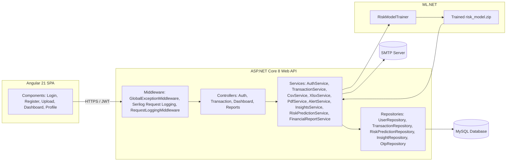

# Architecture Overview

## 1. Purpose

This document describes the architecture of the **AI Financial Health Analyzer** as implemented in the repository. It covers the Angular frontend, the ASP.NET Core backend, the repository and service layers, the database, the ML.NET risk model, authentication, logging, email alerts, and report generation. This document is descriptive only — it reflects what exists in the codebase at the time of writing and introduces no new design decisions.

## 2. High-Level Architecture

The system is a two-tier web application:

- **Frontend** — Angular 21 single-page application (standalone components) that communicates with the backend exclusively over HTTP(S) using JSON and JWT bearer tokens.
- **Backend** — ASP.NET Core 8 Web API organized in a layered architecture: **Controllers → Services → Repositories → EF Core → MySQL**, with a parallel **ML.NET** subsystem for risk classification.

## 3. Angular Frontend

- **Framework**: Angular 21, built entirely with **standalone components** (no `NgModule`).
- **Components**:
  - `LoginComponent` — email/password, Google Sign-In, and mobile OTP login.
  - `RegisterComponent` — email/password registration with optional mobile number.
  - `UploadComponent` — statement upload (CSV/XLSX/XLS/PDF).
  - `DashboardComponent` — spending summary, risk gauge, insights, and charts.
  - `ProfileComponent` — view/update profile and change password.
- **Services** (`ui/src/app/services/`):
  - `AuthService` — registration, login, Google login, OTP send/verify, profile fetch/update, password change. Stores the JWT in `localStorage` under the key `auth_token`.
  - `TransactionService` — file upload, transaction list, spending summary, delete-all.
  - `DashboardService` — dashboard summary, risk, and insights endpoints.
  - `ChartService` — builds Chart.js configurations (doughnut, bar, line, gauge) from dashboard data.
- **Routing & Guards**:
  - `app.routes.ts` defines the application routes.
  - `auth-guard.ts` is a functional `CanActivateFn` that blocks navigation to protected routes (`/upload`, `/dashboard`, `/profile`) when no token is present.
- **Interceptors**:
  - `auth.interceptor.ts` is a functional HTTP interceptor that attaches `Authorization: Bearer <token>` to every outgoing request when a token exists, and calls `logout()` and redirects to `/login` on any `401` response.
- **Charts**: Chart.js 4, rendered by `ChartService` — category donut, monthly bar, trend line (shown only when ≥2 months of data exist), top-5 categories bar, and a semicircular risk gauge colored by risk level.
- **Forms**: Angular template-driven forms (`FormsModule`).
- **Unit testing**: Vitest (Angular CLI's default test runner for this project).
- **Styling**: Plain CSS per component (no CSS framework).

## 4. ASP.NET Core Backend

- **Framework**: ASP.NET Core 8 Web API (`Backend.csproj`).
- **Entry point**: `Program.cs` — configures Serilog, MVC controllers, Swagger (Development only), EF Core (MySQL via Pomelo, or EF Core InMemory when `ASPNETCORE_ENVIRONMENT=Testing`), JWT bearer authentication, CORS, dependency injection for all services/repositories, and the ML model object pool.
- **Controllers** (`Backend/Controllers/`):
  - `AuthController` — `api/auth/*`
  - `TransactionController` — `api/transaction/*`
  - `DashboardController` — `api/dashboard/*`
  - `ReportsController` — `api/reports/*`
- **Middleware pipeline order** (as registered in `Program.cs`):
  1. `GlobalExceptionMiddleware`
  2. `UseSerilogRequestLogging` (per-request structured log line)
  3. `RequestLoggingMiddleware` (custom — logs a `Warning` for failed requests)
  4. Swagger / Swagger UI (Development environment only)
  5. CORS (`DefaultCors` policy)
  6. Authentication (`UseAuthentication`)
  7. Authorization (`UseAuthorization`)
  8. `MapControllers`

## 5. Repository Pattern

Each persisted entity has a dedicated repository implementing an interface defined under `Backend/Repositories/Interfaces/`:

| Interface | Implementation | Responsibility |
|---|---|---|
| `IUserRepository` | `UserRepository` | User CRUD, lookup by email/mobile/provider, existence checks |
| `ITransactionRepository` | `TransactionRepository` | Transaction CRUD, date-range queries, per-month counts, distinct user IDs (for ML training), delete-all |
| `IRiskPredictionRepository` | `RiskPredictionRepository` | Persisting `RiskPrediction` rows |
| `IInsightRepository` | `InsightRepository` | Persisting and replacing `Insight` rows per user |
| `IOtpRepository` | `OtpRepository` | OTP request creation, latest-active lookup, update (failed attempts / used timestamp) |

All repositories take an injected `AppDbContext` (EF Core) and are registered as **Scoped** services in `Program.cs`. Controllers and services depend on the **interfaces**, not the concrete classes (with the exception of `RiskPredictionService` and `AlertService`, which are concrete classes injected directly — see Section 6).

## 6. Service Layer

Services encapsulate business logic and sit between controllers and repositories.

| Service | Registration | Responsibility |
|---|---|---|
| `IAuthService` → `AuthService` | Scoped | Registration, login, Google Sign-In, mobile OTP, profile management, password change, JWT generation |
| `IOtpSender` → `DevelopmentOtpSender` | Scoped | Sends (logs) the OTP — development implementation only |
| `ITransactionService` → `TransactionService` | Scoped | Orchestrates file parsing, duplicate detection, persistence, transaction listing, spending summary, delete-all |
| `CsvService` | Scoped | Parses CSV statements into `Transaction` objects |
| `XlsxService` | Scoped | Parses XLSX/XLS statements into `Transaction` objects (EPPlus) |
| `PdfService` | Scoped | Parses Paytm-format PDF statements into `Transaction` objects (PdfPig) |
| `CategoryPredictionService` | Scoped | Keyword-based category prediction for uncategorized transactions |
| `InsightsService` | Scoped | Generates and persists AI insight messages from feature data |
| `IReportService` → `FinancialReportService` | Scoped | Builds the downloadable PDF financial health report (QuestPDF) |
| `RiskPredictionService` | **Singleton** | Holds the trained ML.NET model behind a `PredictionEngine` object pool; produces the final reconciled risk level and score |
| `RiskModelTrainer` | Scoped | Builds training data (real + synthetic), trains, evaluates, and saves the ML.NET model |
| `ModelTrainingHostedService` | Hosted service (not registered in `Testing`) | Loads any saved model at startup, retrains in the background, hot-swaps the live model |
| `IEmailSender` → `SmtpEmailSender` | Scoped | Sends email via SMTP (MailKit) |
| `AlertService` | Scoped | Builds and sends the plain-text risk alert email |

Static helper classes used by services (not DI-registered, since they are pure functions):

- `RiskLabelGenerator` — explainable rule-based risk scorecard.
- `FinancialFeatureExtractor` — converts raw transactions into an 11-feature vector.
- `TransactionFilters` — single source of truth for which transactions count as "spending" (excludes credits and self-transfers) vs. plain debit/credit checks.

## 7. Database

- **Engine**: MySQL, accessed via **Entity Framework Core 8** with the **Pomelo.EntityFrameworkCore.MySql** provider.
- **Testing override**: when `ASPNETCORE_ENVIRONMENT=Testing`, `Program.cs` switches `AppDbContext` to EF Core's **InMemory** provider, so the automated test suite does not require a real MySQL instance.
- **Context**: `AppDbContext` (`Backend/Data/AppDbContext.cs`) exposes `DbSet<Transaction>`, `DbSet<User>`, `DbSet<Category>`, `DbSet<Insight>`, `DbSet<RiskPrediction>`, `DbSet<AuthProvider>`, `DbSet<OtpRequest>`.
- **Model configuration** (`OnModelCreating`):
  - Unique index on `User.Email`.
  - Unique index on `User.MobileNumber`.
  - Unique composite index on `AuthProvider (ProviderName, ProviderUserId)`.
  - Cascade delete from `User` → `AuthProvider`.
  - Index on `OtpRequest (MobileNumber, ExpiresAtUtc)`.
  - `Transaction.Amount` precision set to `decimal(18,2)`.
  - Lazy navigation auto-include disabled for `User.Transactions`.
- **Migrations** (`Backend/Migrations/`), applied in this order:

  | Migration | Purpose |
  |---|---|
  | `InitialMySql` | Initial `Users`, `Categories`, `Transactions` tables |
  | `AddPasswordHash` | Adds password hash and related auth columns to `Users` |
  | `FixAmountPrecision` | Corrects `decimal` precision on `Transaction.Amount` |
  | `AddRiskAndInsights` | Adds `RiskPredictions` and `Insights` tables |
  | `FixDecimalPrecisionAndUniqueEmail` | Decimal precision fixes; unique index on `Users.Email` |
  | `FixRiskPredictionPrecision` | Decimal precision fixes on `RiskPrediction` columns |
  | `ImproveRiskPredictionFeatures` | Adds extended feature-snapshot columns to `RiskPrediction` |
  | `AddGoogleAndMobileOtpAuth` | Adds `AuthProviders` and `OtpRequests` tables |
  | `AddIsCreditToTransaction` | Adds the `IsCredit` boolean column to `Transaction` |

## 8. ML.NET

- **Library**: `Microsoft.ML` (ML.NET).
- **Trainer**: `SdcaMaximumEntropy` multiclass classifier (`Microsoft.ML.MulticlassClassification.Trainers.SdcaMaximumEntropy`), with `maximumNumberOfIterations: 200`.
- **Pipeline** (`RiskModelTrainer.BuildPipeline`): `Concatenate` 11 feature columns into `Features` → `MapValueToKey` on `Label` (`KeyOrdinality.ByValue`) → `SdcaMaximumEntropy` → `MapKeyToValue` on `PredictedLabel`.
- **Feature vector** (`RiskInput` / `UserRiskFeatures`, 11 features): `MonthlyAvgSpend`, `MonthlySpendStdDev`, `TransactionFrequency`, `LargeTransactionFrequency`, `TopCategoryPercentage`, `CategoryCount`, `EssentialSpendPercentage`, `FoodSpendPercentage`, `EntertainmentSpendPercentage`, `MoMSpendChangePercentage`, `SpendingTrend`.
- **Labels**: `0 = Low`, `1 = Medium`, `2 = High` (`RiskLabelGenerator.LabelLow/Medium/High`).
- **Training data** (`RiskModelTrainer.BuildTrainingSamplesAsync`): real user transaction histories for users with ≥3 transactions, each labeled by `RiskLabelGenerator.GenerateLabel`, plus 36 fixed hand-crafted synthetic samples (12 each for Low/Medium/High) to guarantee label coverage.
- **Split / evaluation**: 80/20 train/test split with `seed: 42`; evaluated with `MulticlassClassification.Evaluate` (`MicroAccuracy`, `MacroAccuracy`, `LogLoss`, `LogLossReduction`). A warning is logged if `MicroAccuracy < 0.60`.
- **Persistence**: the trained model is saved to `Models/risk_model.zip` (path: `RiskModelTrainer.ModelPath`, relative to the application base directory).
- **Serving** (`RiskPredictionService`): a **singleton** holding the model behind an `ObjectPool<PredictionEngine<RiskInput, RiskOutput>>` (via `DefaultObjectPoolProvider`) for thread-safe, low-overhead predictions.
- **Reconciliation logic**: `RiskPredictionService.Predict` always computes the explainable rule-based assessment first (`RiskLabelGenerator.GenerateAssessment`). If the ML model is loaded, its predicted label is accepted **only if it is at most one severity rank away** from the rule-based level (`ReconcileRiskLevels`); otherwise the rule-based level wins. The **`RiskScore`** value returned to API clients is always the rule-based scorecard's severity percentage (0.0–1.0), **not** the ML model's class probability.
- **Background training** (`ModelTrainingHostedService`, an `IHostedService`): on startup, loads an existing saved model immediately if present (for fast availability), then always retrains in the background using current transaction data, hot-swapping the live model in `RiskPredictionService` once training completes. This hosted service is **not registered** when `ASPNETCORE_ENVIRONMENT=Testing`.

## 9. Authentication

- **Mechanism**: JWT Bearer (`Microsoft.AspNetCore.Authentication.JwtBearer`), validated with `ValidateIssuer`, `ValidateAudience`, `ValidateLifetime`, and `ValidateIssuerSigningKey` all `true`, against `Jwt:Issuer`, `Jwt:Audience`, and a symmetric key built from `Jwt:Key` (HMAC-SHA256). `Jwt:Key` must be at least 32 characters or the application throws at startup.
- **Claims**: every issued token contains `ClaimTypes.NameIdentifier` and a custom `userId` claim, both set to the user's integer `Id`. Controllers read the user ID via `User.FindFirst(ClaimTypes.NameIdentifier) ?? User.FindFirst("userId")`.
- **Expiry**: `Jwt:ExpiryDays` (default 7 days).
- **Supported login methods**:
  1. **Email + password** (`AuthController.Register` / `Login`) — passwords hashed with BCrypt (`BCrypt.Net.BCrypt.HashPassword` / `Verify`). On a "user not found" login attempt, a dummy `BCrypt.Verify` call is still executed to reduce timing-based user enumeration.
  2. **Google Sign-In** (`AuthController.GoogleLogin`) — the credential (Google ID token) is verified server-side via `GoogleJsonWebSignature.ValidateAsync` against the configured `Authentication:Google:ClientId`. The account is matched first by an existing `AuthProvider` row (`ProviderName = "Google"`, `ProviderUserId = payload.Subject`), then by normalized email; a new `User` and `AuthProvider` link are created if no match exists.
  3. **Mobile OTP** (`AuthController.SendOtp` / `VerifyOtp`) — a 6-digit OTP is generated with `RandomNumberGenerator`, hashed with BCrypt, and stored as an `OtpRequest` with a configurable expiry (`Otp:ExpiryMinutes`, default 5) and max verification attempts (`Otp:MaxAttempts`, default 5). `DevelopmentOtpSender` logs the OTP to the console instead of sending an SMS.
- **Authorization**: `[Authorize]` is applied at the controller level for `TransactionController`, `DashboardController`, and `ReportsController`, and at the action level for the profile/password endpoints in `AuthController`.
- **Frontend integration**: `AuthService` (Angular) stores the JWT in `localStorage` (`auth_token`); `authInterceptor` attaches it to outgoing requests and triggers logout + redirect to `/login` on `401`; `authGuard` blocks navigation to `/upload`, `/dashboard`, and `/profile` without a token.

## 10. Logging

- **Library**: Serilog, bootstrapped in `Program.cs` (`Log.Logger` bootstrap logger, then `builder.Host.UseSerilog`).
- **Sinks**: Console, and a rolling file sink at `Logs/application-log.txt` (`rollingInterval: Infinite`, `shared: true`).
- **Enrichers**: `FromLogContext`, `WithMachineName`, `WithThreadId`, plus a custom `Environment` property set to the hosting environment name.
- **Minimum levels**: `Information` by default; `Microsoft`, `Microsoft.AspNetCore`, `Microsoft.EntityFrameworkCore.Database.Command`, and `System` overridden to `Warning`.
- **Request logging**: `UseSerilogRequestLogging` logs one line per HTTP request with a custom message template (`HTTP {RequestMethod} {RequestPath} responded {StatusCode} in {Elapsed} ms`) and a custom level selector — `Error` for exceptions or 5xx, `Warning` for 4xx, `Information` otherwise.
- **Custom middleware**: `RequestLoggingMiddleware` additionally logs a `Warning` for any response with status ≥ 400, including the authenticated user ID (or `"Anonymous"`) when available.
- **Exception logging**: `GlobalExceptionMiddleware` logs `Warning` for `UnauthorizedAccessException`, `ArgumentException`, and `InvalidOperationException`, and `Error` for all other unhandled exceptions, before writing a consistent JSON `ApiResponse<object>` error envelope.
- **Domain-level logging**: services such as `AuthService`, `CsvService`, `XlsxService`, `PdfService`, `TransactionService`, `AlertService`, `RiskPredictionService`, `RiskModelTrainer`, and `ModelTrainingHostedService` each log their own informational, debug, and warning/error events via injected `ILogger<T>` instances.

## 11. Email Alerts

- **Sender**: `SmtpEmailSender` implements `IEmailSender` using **MailKit**/**MimeKit**, connecting via `SecureSocketOptions.StartTls` and authenticating with `Smtp:Username` / `Smtp:Password`.
- **Configuration**: bound from the `Smtp` section of `appsettings.json` (`Smtp:Host`, `Smtp:Port`, `Smtp:EnableSsl`, `Smtp:FromEmail`, `Smtp:FromName`, `Smtp:Username`, `Smtp:Password`) into the `SmtpSettings` options class.
- **Composition**: `AlertService.SendRiskAlertAsync` builds a plain-text email with the user's risk level, score (as a percentage), description/summary, risk factors, and positive signals, and sends it via `IEmailSender`.
- **Triggers**:
  1. After every successful statement upload — `TransactionController.UploadFile` → `TryGenerateRiskAndSendAlertAsync` (best-effort; only runs if at least one transaction exists for the user).
  2. Whenever the dashboard risk endpoint is called — `DashboardController.GetRisk`.
- **Failure handling**: if the user has no email on file, or the SMTP send fails for any reason, the failure is caught, logged via `ILogger`, and swallowed. It never blocks or fails the upload/risk-check request that triggered it.

## 12. Report Generation

- **Library**: QuestPDF (Community license, configured in `Program.cs` via `QuestPDF.Settings.License = LicenseType.Community`).
- **Service**: `FinancialReportService` implements `IReportService.GenerateFinancialReportPdfAsync(int userId)`.
- **Endpoint**: `GET /api/reports/financial/pdf` (`ReportsController.DownloadFinancialReport`), returns the PDF as a `FileContentResult` (`application/pdf`) with filename `financial-health-report-{yyyyMMddHHmmss}.pdf`.
- **Report sections** (built in `FinancialReportService.BuildPdf`):
  1. Executive Summary (total spent, total received, transaction volume, total transactions, average expense, average monthly spend).
  2. Risk Score and Explanation (risk level, risk score, scorecard summary).
  3. Spending Category Breakdown (up to 12 categories).
  4. Monthly Expense Breakdown.
  5. AI Insights (up to 8, ordered by priority descending in the report table — see `Backend/Services/FinancialReportService.cs`).
  6. Top Spending Transactions (top 10 by absolute amount, excluding credits and transfers).
- **Behavior with no transactions**: if the user has zero transactions, an "empty" report is still generated with an `Unknown` risk level and explanatory placeholder text rather than an error.
- **Side effects**: generating the report also persists a new `RiskPrediction` row and regenerates/replaces the user's `Insight` rows (same mechanism as the dashboard `risk`/`insights` endpoints).

## 13. Cross-Cutting: CORS

- CORS is configured via the `DefaultCors` policy in `Program.cs`, allowing the origins listed in `Cors:AllowedOrigins` (`appsettings.json`; default `http://localhost:4200`), any header, any method, and credentials (`AllowCredentials()`).

## 14. Cross-Cutting: API Documentation

- Swagger / OpenAPI (Swashbuckle) is registered unconditionally but only **served** (`UseSwagger` / `UseSwaggerUI`) when `app.Environment.IsDevelopment()` is true. The Swagger UI is configured with a `Bearer` JWT security scheme.
