# Data Flow

This document traces the complete, end-to-end data flow through the application, from user login through statement upload, parsing, validation, duplicate detection, database storage, feature extraction, ML risk prediction, insights generation, the dashboard, email alerts, and report generation. Every step described below is backed by a corresponding class/method in the codebase, referenced inline.

## 1. End-to-End Overview

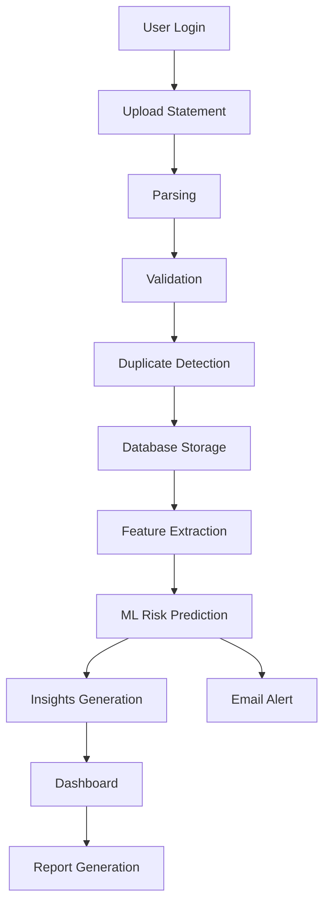

## 2. User Login

Three login methods all converge on the same JWT issuance step.

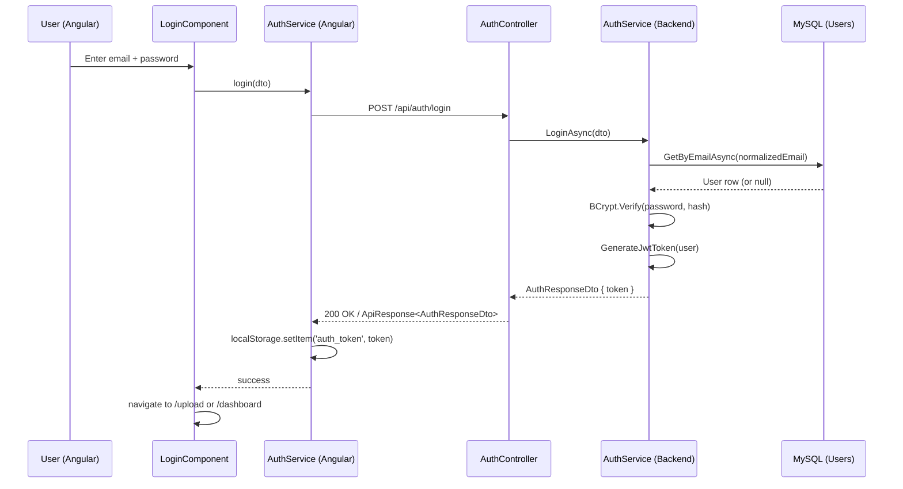

For Google Sign-In, the same flow applies except `GoogleLoginAsync` validates the credential via `GoogleJsonWebSignature.ValidateAsync` and links/creates the user via `AuthProviders`. For mobile OTP, `SendMobileOtpAsync` generates and stores a hashed OTP, and `VerifyMobileOtpAsync` validates it before issuing the same JWT.

Once a token exists, every subsequent request from the Angular app passes through `authInterceptor`, which attaches `Authorization: Bearer <token>`. The backend's `[Authorize]` filter and JWT bearer middleware validate the token before any controller action runs; `authGuard` on the frontend additionally blocks navigation to `/upload`, `/dashboard`, `/profile` without a token.

## 3. Upload Statement → Parsing → Validation → Duplicate Detection → Database Storage

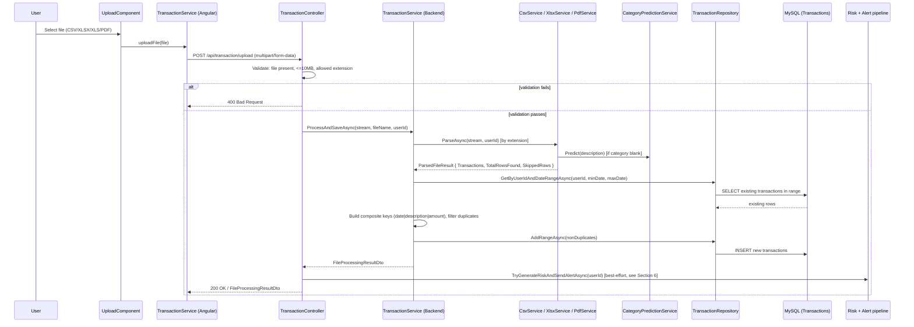

### 3.1 Parsing

Parsing is dispatched by file extension in `TransactionService.ProcessAndSaveAsync`:

| Extension | Parser | Library |
|---|---|---|
| `.csv` | `CsvService.ParseAsync` | Hand-written RFC-4180-aware splitter |
| `.xlsx` / `.xls` | `XlsxService.ParseAsync` | EPPlus |
| `.pdf` | `PdfService.ParseAsync` | PdfPig (Paytm statement format only) |

Each parser independently determines transaction direction (credit/debit) using the same three-tier strategy (CSV/XLSX) or the embedded `+`/`-` sign in the statement text (PDF):

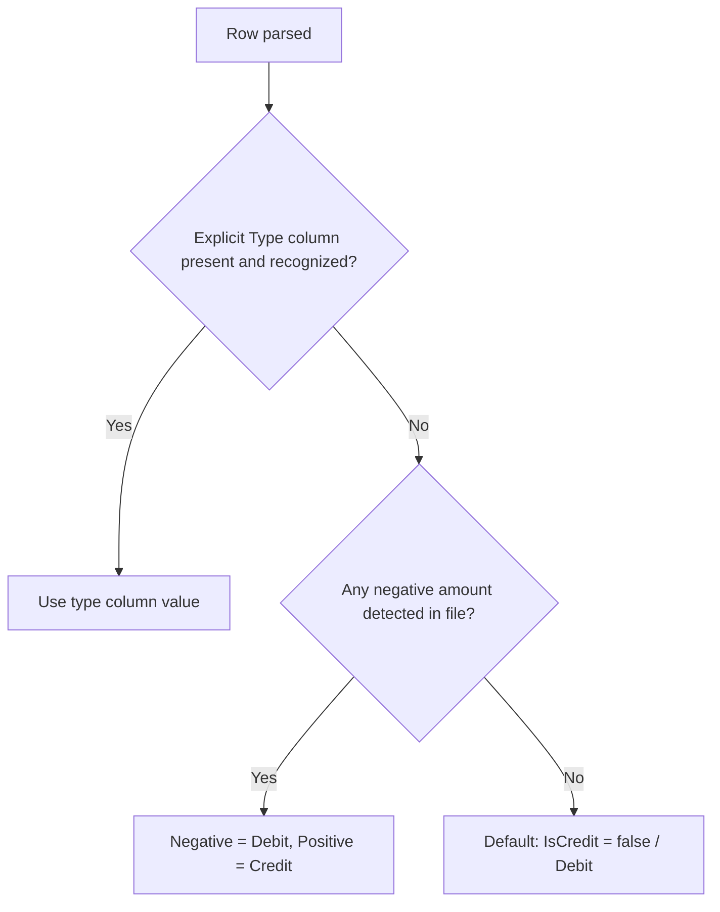

If a category is blank or `"Uncategorized"`, `CategoryPredictionService.Predict(description)` assigns one of: `Food`, `Transport`, `Shopping`, `Utilities`, `Income`, `Entertainment`, `UPI`, or `Others` based on keyword matching. Credits left as `Uncategorized`/`Others` after prediction are reclassified as `Income`.

### 3.2 Validation

Performed by `TransactionController.UploadFile` before any parsing occurs:

1. File must be present and non-empty (`400` otherwise).
2. File size must be ≤ 10 MB (`400` otherwise).
3. File extension must be one of `.csv`, `.xlsx`, `.xls`, `.pdf` (`400` otherwise).

Row-level validation happens inside each parser: rows with fewer than 3 columns, unparsable dates, unparsable/zero amounts, or empty descriptions are skipped and counted in `SkippedRows`.

### 3.3 Duplicate Detection

Performed in `TransactionService.ProcessAndSaveAsync`:

1. Compute `minDate`/`maxDate` spanning the newly parsed rows.
2. Fetch existing transactions for the user within that date range (`GetByUserIdAndDateRangeAsync`).
3. Build a normalized composite key for each existing and new row: `{date:yyyy-MM-dd}|{description, trimmed/lowercased/whitespace-collapsed}|{Math.Abs(amount) as InvariantCulture string}`.
4. Any new row whose key matches an existing key is counted as a duplicate and not persisted.
5. If all non-duplicate new rows fall within a single calendar month that already has existing transactions, a `MonthWarning` message is included in the response.

### 3.4 Database Storage

Non-duplicate `Transaction` entities are persisted via `TransactionRepository.AddRangeAsync`, which calls `AppDbContext.Transactions.AddRangeAsync` followed by `SaveChangesAsync`. The same `AppDbContext` (MySQL via Pomelo, or EF Core InMemory under `ASPNETCORE_ENVIRONMENT=Testing`) backs all transaction reads/writes.

## 4. Feature Extraction

Triggered whenever a risk assessment is needed (after upload, on `GET /api/dashboard/risk`, on `GET /api/dashboard/insights`, or during PDF report generation).

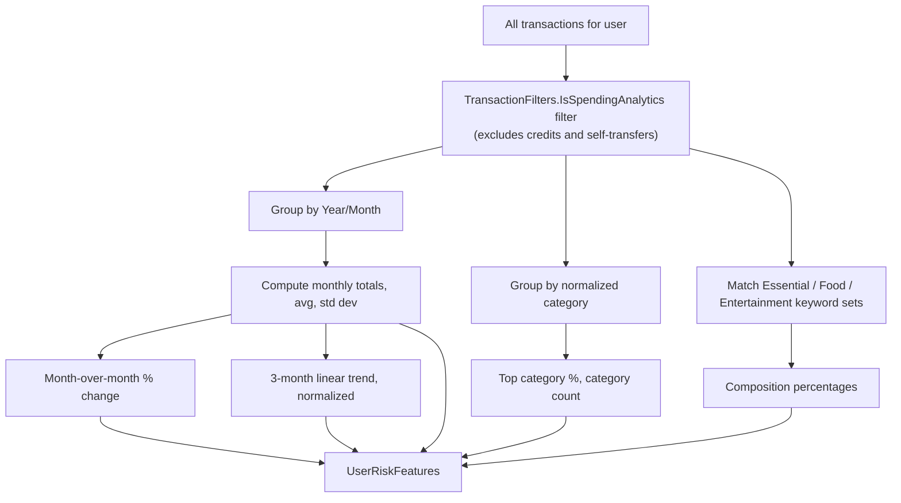

`FinancialFeatureExtractor.Extract(transactions)` is a pure, static function that produces the 11-feature `UserRiskFeatures` vector: `MonthlyAvgSpend`, `MonthlySpendStdDev`, `TransactionFrequency`, `LargeTransactionFrequency`, `TopCategoryPercentage`, `CategoryCount`, `EssentialSpendPercentage`, `FoodSpendPercentage`, `EntertainmentSpendPercentage`, `MoMSpendChangePercentage`, `SpendingTrend` — plus contextual fields (`TopCategory`, `TotalSpend`, `TotalTransactions`, `MonthCount`, `MonthlyTotals`) used for insight text, not fed into the ML model.

## 5. ML Risk Prediction

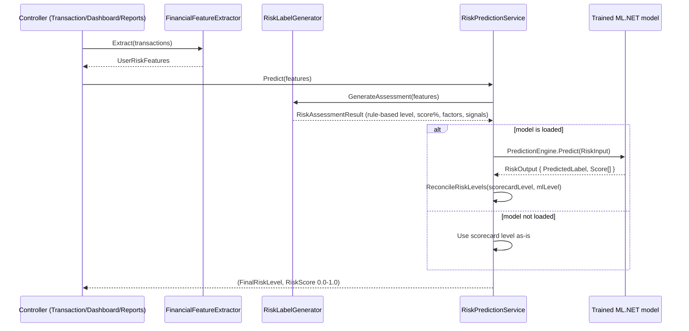

Key rule: the ML model's predicted label is accepted only if it is **at most one severity rank** away from the rule-based scorecard's level (`RiskRank`: Low=1, Medium=2, High=3); otherwise the rule-based level wins. The numeric `RiskScore` returned to every API consumer is **always** the rule-based scorecard's severity percentage (0.0–1.0) — never the ML model's raw class probability.

The rule-based scorecard (`RiskLabelGenerator.GenerateAssessment`) accumulates points (0–12 max) across six weighted categories — spending magnitude, volatility (coefficient of variation), category concentration, discretionary spend (food/entertainment), large-transaction frequency, and month-over-month/3-month trend — then converts the total to a percentage with a 15% floor (for users with real spending data) and buckets it: `<35% = Low`, `35–70% = Medium`, `≥70% = High`. Users with zero transactions or zero total spend get `"Unknown"` with a 0% score.

The result is persisted as a new `RiskPrediction` row via `IRiskPredictionRepository.SaveAsync` — one row per prediction run (upload, dashboard risk check, or report generation), each carrying a snapshot of the feature values used (for auditability and future retraining), not an update to a single "current" row.

### 5.1 Background Model Training

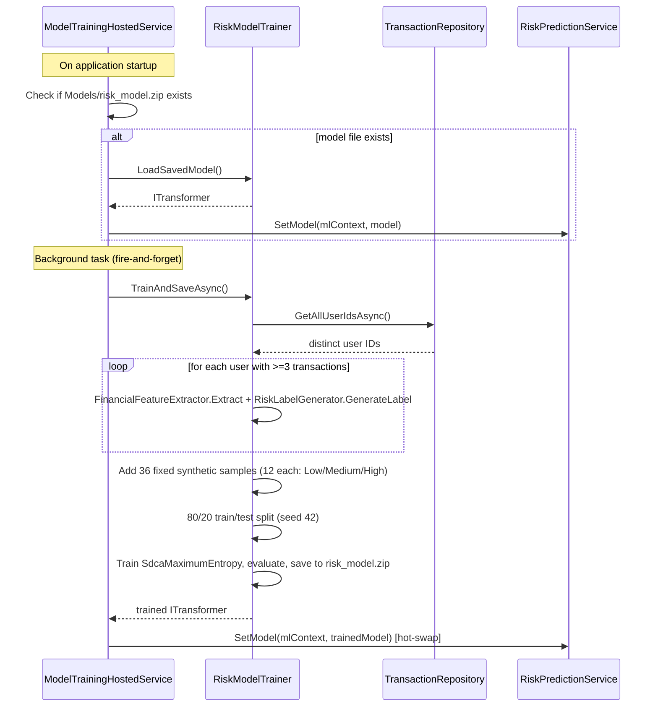

This hosted service is **not registered** when `ASPNETCORE_ENVIRONMENT=Testing`.

## 6. Insights Generation

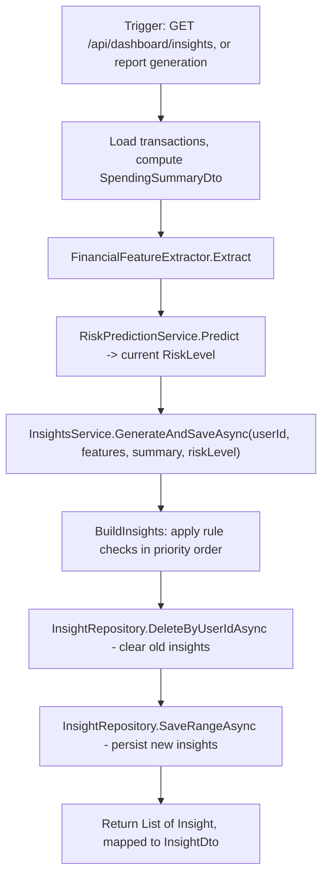

`InsightsService.BuildInsights` applies an ordered set of rule checks (overall risk level, food spending %, entertainment spending %, category concentration, month-over-month change, 3-month trend, spending volatility, large-transaction frequency, low category diversity, and a positive "healthy pattern" acknowledgement for Low-risk users with ≥3 categories), each producing a titled `Insight` with a `Priority` (1 = highest) and a `Type` of `"info"`, `"warning"`, or `"danger"`. Insights are fully **replaced** on every generation — old rows for the user are deleted before the new set is saved.

## 7. Dashboard

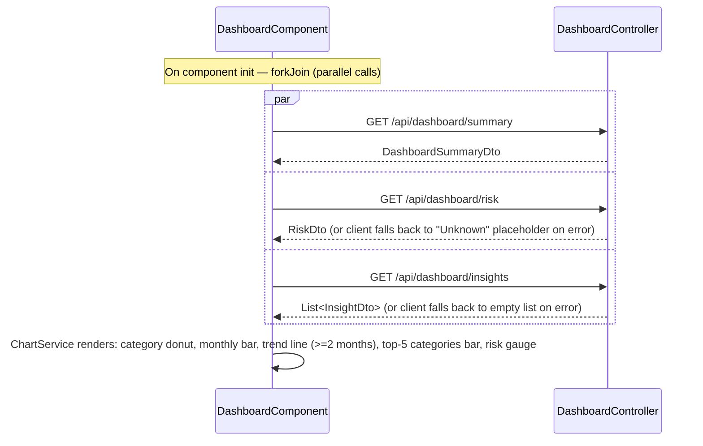

The dashboard additionally surfaces: an empty state when there is no data, the highest spending category and biggest single expense, month-over-month change (currency + percentage, styled positive/negative), and a **Download PDF Report** button.

## 8. Email Alert

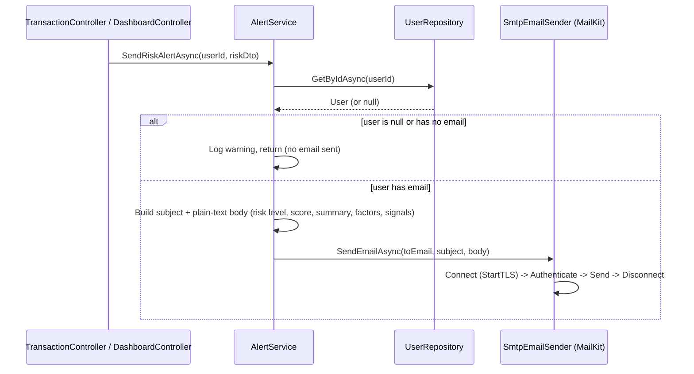

Triggers:

1. After every successful statement upload (`TransactionController.UploadFile` → `TryGenerateRiskAndSendAlertAsync`) — only if the user has at least one transaction.
2. Whenever `GET /api/dashboard/risk` is called (`DashboardController.GetRisk`).

In both cases the send is wrapped in a `try/catch`: any exception (missing email, SMTP failure, etc.) is logged via `ILogger` and swallowed — it never causes the triggering request (upload or risk check) to fail.

## 9. Report Generation

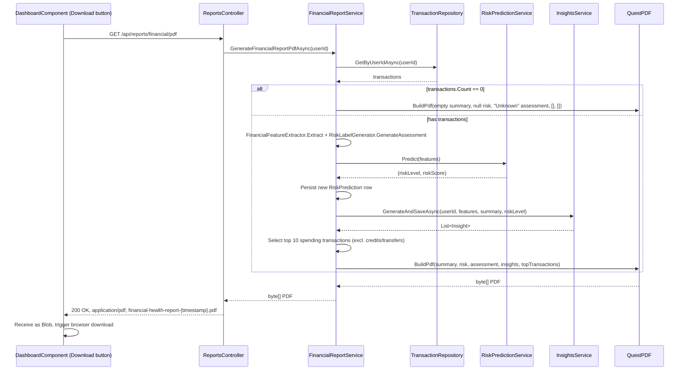

The generated PDF contains six sections: Executive Summary, Risk Score and Explanation, Spending Category Breakdown (top 12), Monthly Expense Breakdown, AI Insights (top 8 by the ordering applied in `FinancialReportService`), and Top Spending Transactions (top 10 by absolute amount). Generating a report is **not** a read-only operation — it persists a new `RiskPrediction` row and replaces the user's stored `Insight` rows, exactly as the dashboard `risk`/`insights` endpoints do.
